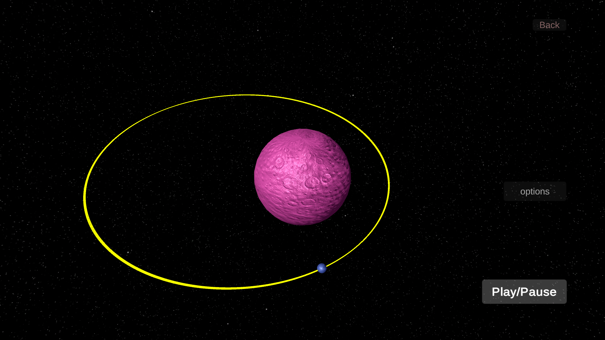
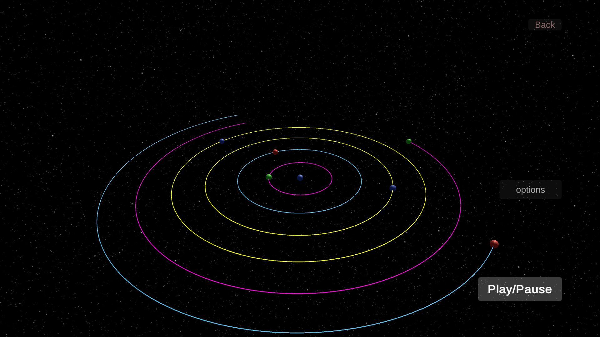
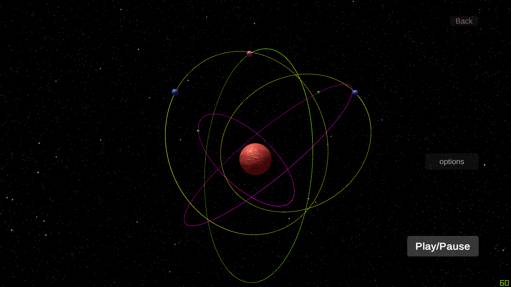

# Gravity_Simulation-Qwert
Gravity simulation application made using Unity3D.

Use unity3D engine to open the project.
(OR) To download the application(windows only), visit https://drive.google.com/drive/folders/1SC0dd-whoUFcv-v6sNYSU3mDbrkrOCNS?usp=sharing > download the Gravity.zip file > unzip > execute gtest2.exe. 
